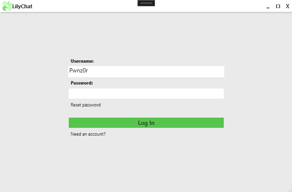

# CHAT APP & SERVER
This is a assignment project. I decided to make a chatapp with a client and a server. The gui is made in wpf.
A few months ago, i made a similar app. So i wanted to expand on my knowledge and add better functions to this version.
Here are some of the functions im "planning" to include, depending on how smooth the process will be:
- Sounds based on events(receiving a message, login).
- ~~Additional view (Maybe a small window of some sort. Hopefully)~~ :white_check_mark:
- ~~Some form of way to handle username. Either given at random(placeholder) or type in username, with no requirements(Also placeholder with no saving)~~ :white_check_mark:
- End to end encryption (skipped for now, as it needed to much changes to preexisting systems). ❌ 
- try to use it off of local internet.(probably not going to happen within the deadline)
- ~~Direct message instead of broadcasting to all clients~~ :white_check_mark:  
- ~~displaying `LastMessage`, `FirstMessage` and `IsOwnMessage` correctly, with colors and bubbles.~~ :white_check_mark:
- have the server use a none hardcoded ip.

### Challanges with the project
- I decided to use asynchronous programming because I had heard it would improve performance when handling multiple clients. Implementing async was a real challenge since it required, pretty much every part of the application, from top to bottom, to be asynchronous.
- I had difficulties finding the source of the issues i had, as it was hard debugging. Evident by the number of debug writeLines in the project.
- Many of the issues were entirely caused by XAML, which was unexpected and took me far too long to diagnose. Small syntax and binding issues prevented the app from running for days.

 

Latest look of the `LoginWindow` and the placeholder usernames.

Early on in the project, i made this design in xaml. But i soon realized that some of the pieces i used, didnt have the nessecary presets or settings that i needed to link the design with the backend part. 
  
I made this diagram before starting the project, to show a rough idea of the function of the app.

### What the app does at its current stage:
When you launch the app, both the server (with a console) and the client start. The client initially opens the `LoginWindow`, which currently serves as a placeholder but generates a random "edgy" username on launch. Pressing the login button closes the `LoginWindow` and opens the `MainWindow`, where the client attempts to connect to the server. The server is hardcoded to run on a specific IP (placeholder), but other computers on the same network can connect and will be able to see each other in the contacts list. Clicking on one of the contacts, will make you able to send direct messages to that client.

## Features
- Custom scrollbar.
- Custom minimize, maximize and exit buttons and windowbar with name and logo.
- Reasizable window, with dragging function.
- Status indication for server connection.
- Asynchronous socket handling.
- Real-time messaging.
- Dynamically updates connected users.
- Opcode based communication.
- Big portion of the styling is done through resource dictionaries.
- Logic and ui is separated.
- Can be used over LAN, no internet required.

## How to run
- Fork/Clone repo from github
- In VS right click solution > Properties > Multiple startup projects(or manually open the exe file from debug folder).
- Choose action for `ChatClient` and `ChatServer` to start.
- Make sure  `ChatServer` launches first.

### Resources made by someone else: 

 Icons made by <a href="https://www.flaticon.com/authors/those-icons" title="Those Icons"> Those Icons </a> from <a href="https://www.flaticon.com/" title="Flaticon">www.flaticon.com'</a>

 Icons made by <a href="https://www.flaticon.com/authors/tanah-basah" title="Tanah Basah"> Tanah Basah </a> from <a href="https://www.flaticon.com/" title="Flaticon">www.flaticon.com'</a>

 Icons made by <a href="https://www.flaticon.com/authors/kiranshastry" title="Kiranshastry"> Kiranshastry </a> from <a href="https://www.flaticon.com/" title="Flaticon">www.flaticon.com'</a>

 Icons made by <a href="https://www.flaticon.com/authors/amazona-adorada" title="Amazona Adorada"> Amazona Adorada </a> from <a href="https://www.flaticon.com/" title="Flaticon">www.flaticon.com'</a>

