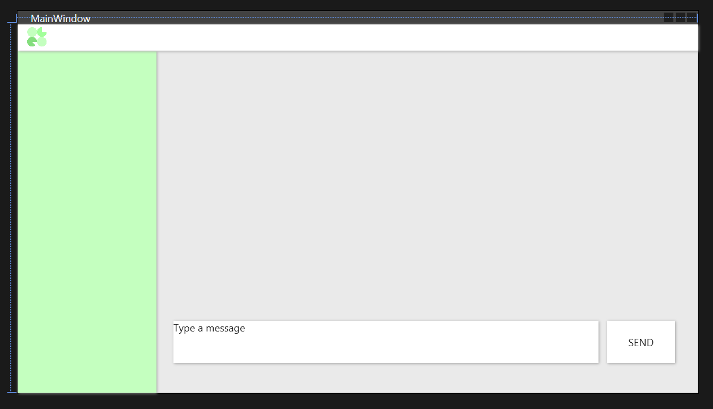
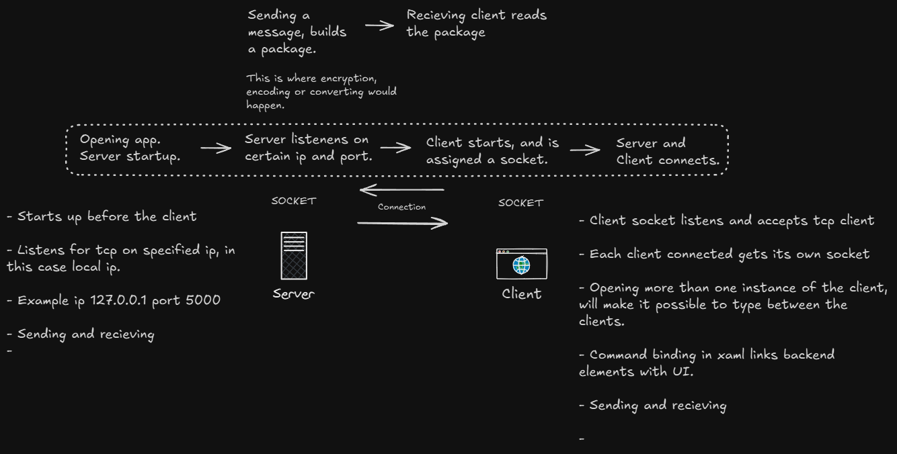

# CHAT APP & SERVER
This is a school assignment project. I decided to make a chatapp with a client and a server. The gui is made in wpf.
A few months ago, i made a similar app. So i wanted to expand on my knowledge and add better functions to this version.

   
Early on in the project, i made this design in xaml. But i soon realized that some of the pieces i used, didnt have the nessecary presets or settings that i needed to link the design with the backend part. 
  
I made this diagram before starting the project, to show a rough idea of the function of the app.
### Resources used: 

#### Pictures from unsplash
[profile1](https://unsplash.com/photos/a-man-in-a-white-tank-top-and-a-yellow-towel-on-his-head-JhqGVkxR1pA),
[profile2](https://unsplash.com/photos/a-woman-in-a-black-jacket-standing-in-the-dark-JS8diHy9Ntc),
[profile3](https://unsplash.com/photos/a-man-sitting-on-a-chair-playing-a-guitar--ZXIaqsEnJM).
